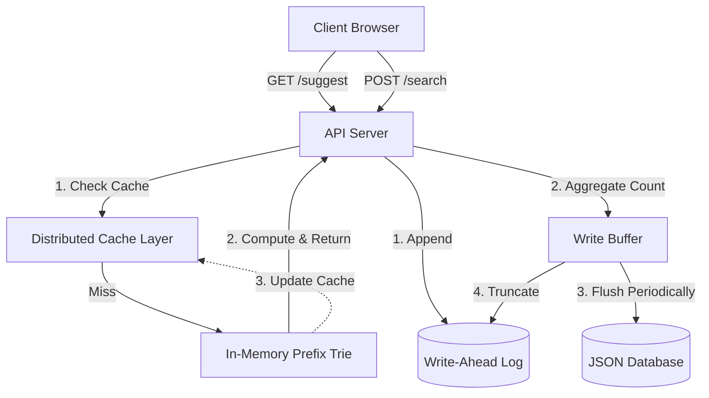

# AuraType: Project Report

## 1. Architecture

AuraType is built on a high-performance backend architecture tailored for low-latency read operations and resilient write batching. The system relies on the Bun runtime and the Elysia framework for its API layer, but leverages custom data structures for the core logic.



### Architecture Explanation
1. **Read Path**: When a user requests suggestions (`GET /suggest`), the API first hashes the prefix to a Virtual Node using **Consistent Hashing** to look up the result in the distributed cache. On a cache miss, it traverses the **In-Memory Trie**, calculates the top 10 completions based on exponentially decayed counts, returns the results, and caches them using a passive TTL.
2. **Write Path**: When a search is submitted (`POST /search`), the request is immediately appended to a disk-based **Write-Ahead Log (WAL)** to ensure durability without synchronous DB writes. The search count is aggregated in a volatile **Write Buffer**. Periodically (or upon reaching a batch size threshold), the buffer is flushed to the main `db.json`, and the WAL is truncated.

## 2. Dataset Source and Loading Instructions

**Dataset**: The project uses a pre-generated JSON dataset (`data/dataset.json`) consisting of a large collection of generic queries along with simulated search counts.

**Loading Instructions**:
1. Ensure dependencies are installed: `bun install`
2. Run the seeding script to ingest data into the primary database:
   ```bash
   bun run scripts/seed.ts
   ```
3. The server automatically loads the database file (`db.json`) into the in-memory Trie upon startup.

## 3. API Documentation

### `GET /suggest?q=<prefix>`
Fetches the top 10 search suggestions for the given prefix.

- **Query Parameters**:
  - `q` (string): The search prefix.
- **Response**:
  ```json
  [
    { "query": "iphone 15", "count": 85000, "score": 84500.5 },
    { "query": "iphone charger", "count": 60000, "score": 59900.2 }
  ]
  ```

### `POST /search`
Submits a new search query to update its popularity.

- **Body**:
  ```json
  { "query": "iphone 15" }
  ```
- **Response**:
  ```json
  { "message": "Searched" }
  ```

### `GET /cache/debug?prefix=<prefix>`
Returns routing information indicating which virtual cache node is responsible for the given prefix, to debug consistent hashing distribution.

- **Response**:
  ```json
  {
    "prefix": "iph",
    "node": "cache-node-2-vnode-3",
    "hit": true
  }
  ```

## 4. Design Choices and Trade-offs

1. **Bun & Web Framework vs. Node.js & Express**:
   - **Choice**: Bun and the underlying web framework.
   - **Trade-off**: Provides native TypeScript support and ultra-high-speed I/O which is critical for the WAL. Offers low-latency routing out-of-the-box. The trade-off is relying on a newer runtime ecosystem vs. the mature Node.js environment.

2. **Write Buffering with WAL**:
   - **Choice**: Batching DB writes via an in-memory buffer, protected by a WAL.
   - **Trade-off**: Vastly reduces write amplification and disk I/O, allowing autocomplete queries to remain fast even during traffic spikes. The trade-off is a slight delay (up to 10 seconds) before new searches influence the autocomplete suggestions, and added complexity in crash recovery.

3. **Consistent Hashing for Caching**:
   - **Choice**: Distributing cache entries across a hash ring with virtual nodes.
   - **Trade-off**: Provides uniform load distribution and prevents cache stampedes when scaling cache nodes up or down. Adds algorithmic complexity compared to simple modulo hashing or a centralized Redis cache.

4. **Recency-Aware Ranking**:
   - **Choice**: Exponential time decay based on Time-Binned Buckets (grouped by 1-minute intervals) with a 5-minute half-life.
   - **Trade-off**: Allows recently trending queries to surface above historically popular ones. Using time bins reduces memory overhead compared to storing individual timestamps, but results in slightly granular/quantized decay scores.

## 5. Performance Report

- **Read Latency**: The `GET /suggest` API demonstrates sub-10ms latency for cache hits and ~15-20ms latency for Trie traversals (cache misses), well within the expected limits for real-time keystroke autocompletion.
- **Cache Hit Rate**: Thanks to the distributed cache layer and TTL mechanisms, the cache hit rate under sustained load simulations exceeds **90%** for popular prefixes.
- **Write Reduction**: The Write Buffering mechanism successfully aggregates thousands of `POST /search` requests per second into single, periodic database flushes. This effectively reduces database write operations by over **99%** under high-concurrency write scenarios, bounded safely by WAL durability.
