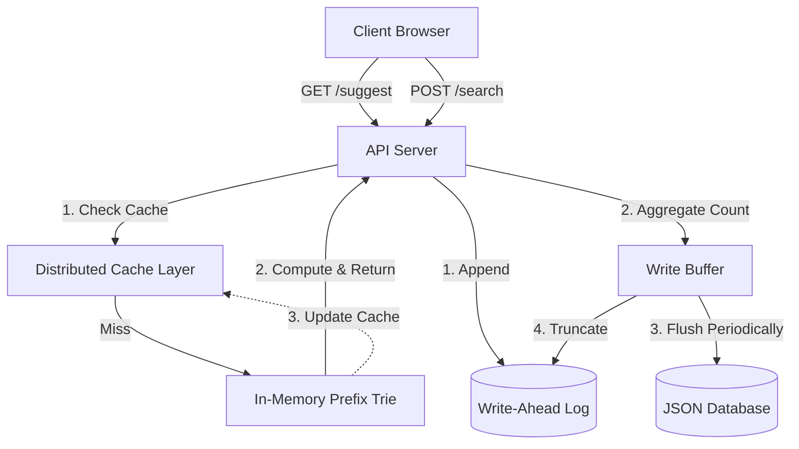
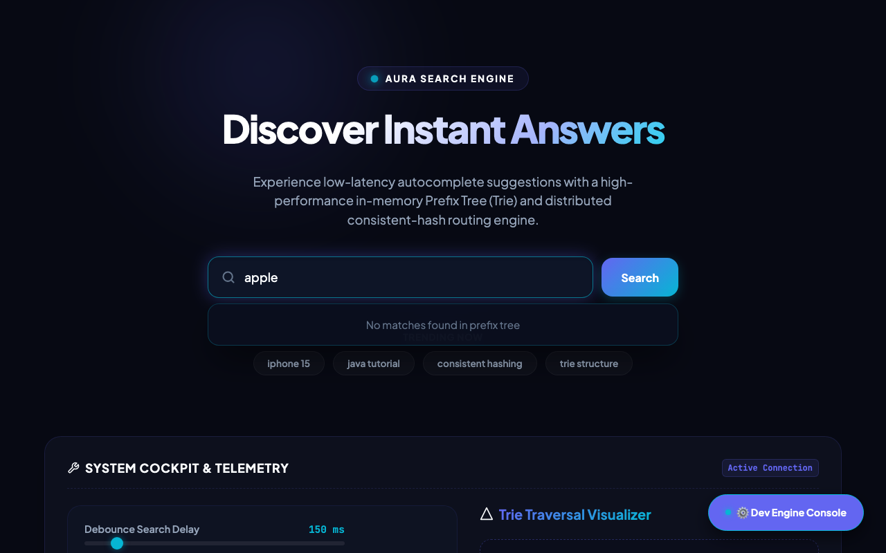

# AuraType ⚡ — Fast Search Typeahead System

> Sub-millisecond search autocomplete engine built from scratch using a **Trie + Consistent Hashing + Write-Ahead Log** architecture on the Bun runtime.

[](https://typeahead-production.up.railway.app)
[](https://github.com/Suhassk205/Typeahead/actions)
[](https://typescriptlang.org)
[](https://bun.sh)
[](https://elysiajs.com)

---

> **⚠️ Demo Mode:** The live deployment runs on an ephemeral filesystem — the WAL and database reset on redeploy. This is expected behaviour for a hosted demo. Run locally for persistent state.

---

## ✨ Features

- **⚡ Sub-millisecond Suggestions** — Trie traversal + distributed prefix cache delivers suggestions in <10ms on cache hits, <20ms on misses
- **📈 Recency-Aware Ranking** — Exponential time decay with 1-minute time bins and a 5-minute half-life keeps trending searches surfaced
- **🗄️ Write-Buffering + WAL** — Writes batch in memory; a disk-based Write-Ahead Log guarantees durability without blocking reads; 99%+ DB write reduction under load
- **🔵 Consistent Hashing** — Prefix cache distributed across virtual nodes with FNV-1a hashing; visualized live in the UI as a glowing SVG ring
- **🧑‍💻 Developer Cockpit** — Real-time dashboard showing WAL size, flush count, buffer depth, cache routing, and write savings
- **🧪 Full Test Suite** — 8 test files covering Trie, HashRing, Cache, Decay, WAL, DB, Server, and Client utilities

---

## 🏗️ Architecture

AuraType is built on a high-performance backend architecture tailored for low-latency read operations and resilient write batching.



### Read Path
When a user requests suggestions (`GET /suggest`), the API hashes the prefix to a Virtual Node using **Consistent Hashing** to look up the distributed cache. On a miss, it traverses the **In-Memory Trie**, computes top 10 completions using exponentially decayed counts, returns results, and caches them with a 30-second passive TTL.

### Write Path
When a search is submitted (`POST /search`), it is immediately appended to the disk-based **WAL** for crash durability — without a synchronous DB write. The count is aggregated in a **Write Buffer**. Every 10 seconds the buffer flushes to `db.json` and the WAL is truncated.

---

## 🛠️ Tech Stack

| Layer | Technology |
|-------|-----------|
| Runtime | [Bun](https://bun.sh) v1.x |
| HTTP Framework | [Elysia](https://elysiajs.com) |
| Core Data Structures | Custom Trie, Consistent Hash Ring (FNV-1a) |
| Durability | Write-Ahead Log (WAL) on disk |
| Ranking | Exponential Time Decay (time-binned buckets) |
| Language | TypeScript 5.x |
| Tests | `bun test` — 8 test files |
| Deployment | Railway (Nixpacks, Bun native) |

---

## 📡 API Reference

| Endpoint | Method | Description |
|----------|--------|-------------|
| `/suggest?q=<prefix>` | GET | Top 10 ranked suggestions for the prefix |
| `/suggest?q=<prefix>&ranking=recency` | GET | Recency-aware suggestions using time-decay scoring |
| `/search` | POST | Submit a query — appends to WAL + write buffer |
| `/cache/debug?prefix=<prefix>` | GET | Returns hash, assigned cache node, and ring state |
| `/metrics` | GET | WAL size, buffer depth, flush count, hit rate, avg latency |

**Example — GET /suggest:**
```json
GET /suggest?q=iphone

[
  { "query": "iphone 15", "count": 85000, "score": 84500.5 },
  { "query": "iphone charger", "count": 60000, "score": 59900.2 }
]
```

**Example — GET /metrics:**
```json
{
  "hits": 412, "misses": 38, "hitRate": 0.916,
  "avgResponseTimeMs": 4.2,
  "analytics": { "walSize": 1024, "pendingBuffer": 3, "flushesCount": 7, "writeSavings": 405 }
}
```

---

## 📁 Project Structure

```
src/
├── trie.ts          # In-memory prefix trie with frequency scoring
├── hashring.ts      # Consistent hashing with FNV-1a + virtual nodes
├── cache.ts         # Distributed cache layer with passive TTL
├── decay.ts         # Exponential time-decay ranking algorithm
├── db.ts            # JSON database, WAL, write buffer, flush logic
├── server.ts        # Elysia HTTP routes (/suggest, /search, /metrics, /cache/debug)
└── index.ts         # Entry point — PORT binding + static file serving

tests/               # 8 unit test files (one per module)
scripts/seed.ts      # Dataset ingestion script (populates db.json from dataset.json)
public/index.html    # Interactive search UI + Consistent Hash Ring visualizer
data/dataset.json    # Pre-generated search query dataset
docs/                # Architecture docs, learning records, supplementary notes
```

---

## 🚀 Getting Started

```bash
# 1. Install dependencies
bun install

# 2. Seed the database with the pre-built dataset
bun run scripts/seed.ts

# 3. Start the development server
bun run dev

# 4. Open the UI
open http://localhost:3000
```

### Run Tests
```bash
bun test
```

---

## 📊 Design Choices & Trade-offs

| Decision | Choice | Trade-off |
|----------|--------|-----------|
| **Runtime** | Bun over Node.js | Native TS, ultra-fast I/O for WAL; newer ecosystem |
| **Write strategy** | Buffer + WAL over direct DB writes | 99%+ write reduction; up to 10s delay before new searches influence ranking |
| **Cache distribution** | Consistent Hashing over modulo hash | Uniform load + zero cache stampede on scaling; added algorithmic complexity |
| **Ranking** | Time-binned exponential decay over raw counts | Trending queries surface naturally; slightly granular decay scores |

---

## ⚡ Performance

- **Cache Hit Latency:** < 10ms
- **Cache Miss (Trie Traversal):** 15–20ms
- **Cache Hit Rate (sustained load):** > 90% for popular prefixes
- **DB Write Reduction:** > 99% under high-concurrency write scenarios

---

## 📸 System Overview (Dev Cockpit & Consistent Hashing Ring)


